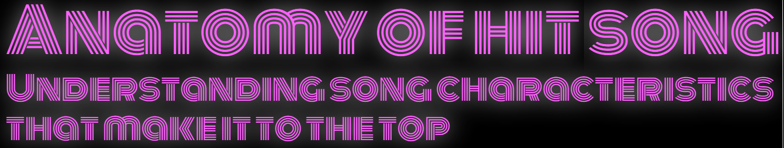

# Anatomy of a Hit Song: Understanding song characteristics that make it to the top

Applied Computational Statistics Final Project by Joan Christine Allon-Pineda, Sydney Austria, Paolo Jose de Guzman, Patrick Guillano La Rosa, Karen Patricia Reyes, Samuelson Anthony Sylim - September 16, 2021. The code, analysis, and the full report are included in the <a href="https://github.com/pgplarosa/Understanding-song-characteristics-tha-make-it-to-the-top/blob/main/md/ACS_Final_Project.md">Technical Report</a>. If you have any questions regarding this study, please send me a message via  <a href="https://www.linkedin.com/in/patricklarosa/">LinkedIn</a>.

## Executive Summary

Popular music is a multi-million dollar industry today. However, the genre is derided as the worst kind of music for its repetitive, almost formulaic, and yet commercially successful style. The objective of this study is to get a glimpse of this formula and understand the audio features that land songs at the top of the charts. Using the 2010-2019 Spotify Hits Predictor Dataset from Kaggle, we conduct statistical tests and perform a logistic regression to find out what makes hits or flops.

Looking into the general composition of audio features between hits and flops, we identified significant differences in group means using Mann-Whitney U test for our non-normally distributed variables. We then assessed the validity of the model and its potential predictors by testing for multicollinearity and linearity with log-odds. Some variables were dropped to meet the assumptions of a logistic regression to allow for valid interpretations of the resulting summary statistics. After implementing a grid search over 10 trials and 10 splits, we then implemented an L1-regularized logistic regression using the C parameter with the highest accuracy.

The optimized logistic regression has an accuracy score of 78 percent. Based on the summary statistics, we derived the following insights:

<ul>
<li>Danceability is the top positive predictor of hits songs.</li>
<li>Valence which represents the level of positivity also increases a song's likelihood of charting.</li>
<li>Instrumentalness appears to be the top yet negative predictor of hit songs, even exceeding danceability and valence combined.</li>
</ul>

We have confirmed that a balance of certain features can contribute to a song's mass appeal and can land it at the top of the charts. Insights gleaned from this study can help artists and music producers find commercial success by producing songs that fit the standard features of those that land on the charts. Finally, record companies can also use this to predict the potential success of the songs they intend to release.

